# AI Bible: The Modular Media Generation System (MMGS)
> Version: 1.0.0  
> Classification: Proprietary & Confidential  
> Owner: Architecture & AI Engineering Team  

ยินดีต้อนรับสู่คู่มือมาตรฐานการพัฒนา (Specification & System Blueprint) สำหรับระบบผลิตสื่อวิดีโออสังหาริมทรัพย์ด้วยปัญญาประดิษฐ์แบบแยกโมดูล (Decoupled Modular AI Video Pipeline)

เอกสารชุดนี้ทำหน้าที่เป็น **Single Source of Truth (SSoT)** เพื่อให้ทั้งทีมนักพัฒนา (Software Engineers) และตัวแทน AI (Claude Code/AI Agents) เข้าใจโครงสร้าง สัญญาการรับส่งข้อมูล (JSON Contracts) กฎการทำงาน (Guardrails) และเป้าหมายทางสถาปัตยกรรมเดียวกัน

---

## 📍 อ่านตรงนี้ก่อน — ตอนนี้ระบบไปถึงไหนแล้ว (2 ส.ค. 2026)

**สรุปสั้นที่สุด:** สายพานผลิตวิดีโอเต็มระบบ **ยังทำไม่จบ** ตอนนี้จึง**แยก "สายโพสต์เพจ" ออกมาทำก่อน**
เพื่อให้เพจมีของลงจริงทุกวันระหว่างรอสายผลิตวิดีโอเสร็จ

### สายที่ใช้งานได้จริงแล้ว — Publish WF

```mermaid
flowchart LR
  subgraph SRC["แหล่งคอนเทนต์"]
    A1["คลิปในคลัง<br/>content/media"]
    A2["หัวข้อความรู้<br/>topics.mjs"]
    A3["ชีทที่ดิน<br/>listings.json"]
  end

  A2 --> C["Carousel Engine<br/>SVG → PNG"]
  A1 --> Q["คิวโพสต์<br/>queue.json"]
  A3 --> Q
  C --> Q

  Q --> CAP["เขียนแคปชั่น<br/>Haiku + template"]
  CAP --> SAN["ตรวจแคปชั่น<br/>sanitize + ย่อความยาว"]
  SAN --> ST{"ตรวจระบบ<br/>/status"}

  ST -->|ผ่าน| AUTO["ช่องอัตโนมัติ<br/>FB Page · Reels<br/>TikTok · YT · LINE"]
  ST -->|ผ่าน| MAN["ช่องกดเอง<br/>ชุดโพสต์ลงกลุ่ม"]
  ST -->|ไม่ผ่าน| STOP["หยุด ไม่โพสต์"]

  MAN --> HUMAN["คนเลือกกลุ่ม<br/>แล้วกดโพสต์เอง"]

  style ST fill:#2a1c0e,stroke:#dda062
  style STOP fill:#2d1411,stroke:#e5786b
  style HUMAN fill:#0f2337,stroke:#6da6de
```



### สายผลิตวิดีโอ — ยังค้าง ยังไม่ต่อเข้าสายบน


> คลิป 7 ตัวใน `output/` ตอนนี้มาจากการทดลอง Video Engine รอบก่อน **โควตา Kling หมดแล้ว
> สร้างใหม่ไม่ได้** จึงห้ามลบ ส่วนสไลด์ carousel ลบได้เสมอเพราะเรนเดอร์ใหม่จาก `topics.mjs` ได้ตลอด

### สถานะรายส่วน

| ส่วน | สถานะ | หมายเหตุ |
|---|---|---|
| Publish Engine + คิวโพสต์ | ✅ ใช้งานจริง | โพสต์ขึ้นเพจสำเร็จแล้ว |
| Facebook Page / Reels | ✅ ต่อแล้ว | token ถาวร ไม่มีวันหมดอายุ |
| Carousel Engine | ✅ ออกแบบใหม่แล้ว | ธีม `daylight` พื้นสว่างโทนธรรมชาติ · ฟอนต์ Sukhumvit Set (ลง Prompt แล้วดีกว่านี้ ดู `assets/README.md`) |
| หน้าตรวจสถานะ `/status` | ✅ ใช้งานจริง | ตรวจ 13 ข้อก่อนปล่อยโพสต์ |
| TikTok / YouTube / Instagram | ⚪ รอ credential | โครงพร้อมแล้ว ใส่ค่าใน `.env` ก็ใช้ได้ |
| Property / Google / House / Video / Render | ⏸ **พักไว้** | สายผลิตวิดีโอ ยังไม่ต่อเข้าคิวโพสต์ |
| ตีเส้นแปลง · ตัดต่อ+ซับ · คลังคอนเทนต์ | 📋 มีสเปกแล้ว | ดู `23_PAGE_STUDIO.md` |

### เอกสารที่เกี่ยวกับงานช่วงนี้
- **`20_ROADMAP.md`** — บันทึกทุกอย่างที่ทำไปแล้วเรียงตามวัน อ่านไฟล์นี้ไฟล์เดียวรู้ว่าไปถึงไหน
- **`21_PUBLISH_SETUP.md`** — วิธีต่อ Facebook / LINE ทีละขั้น
- **`22_DAILY_WORKFLOW.md`** — ใช้งานประจำวัน
- **`23_PAGE_STUDIO.md`** — สเปกของที่ยังไม่ได้ทำ (ตีเส้นแปลง · ตัดต่อ · คลังคอนเทนต์)
- **`assets/README.md`** — วัสดุที่ต้องโหลดเอง (ฟอนต์ · Flaticon · Pixabay · Mixkit) พร้อมเรื่องลิขสิทธิ์

---

## 🛠 Repository Directory Structure
ระบบจะถูกจัดเก็บตามโครงสร้างโฟลเดอร์ดังต่อไปนี้ เพื่อให้ AI Agent สามารถอ้างอิงและประมวลผลข้อกำหนดของระบบได้อย่างแม่นยำ

```text
AI_BIBLE/
├── README.md                      # ไฟล์แนะนำภาพรวมและสารบัญหลัก (ไฟล์นี้)
├── 01_VISION.md                  # วิสัยทัศน์ สถาปัตยกรรมแบบใหม่ และ AI Decision Tree
├── 02_ARCHITECTURE.md            # ภาพรวมการต่อวงจรระบบ (System Topology) และการเชื่อมต่อ
├── 03_SYSTEM_RULES.md            # กฎเหล็กของระบบ (Global System Guardrails)
├── 04_WORKFLOW.md                # รายละเอียดท่อส่งข้อมูล (Data Pipeline) จากต้นน้ำถึงปลายน้ำ
├── 05_DATABASE.md                # โครงสร้างตารางและ Cache Layer ของข้อมูล
├── 06_JSON_CONTRACT.md           # สัญญาการส่งมอบข้อมูลระหว่าง Engine ทั้งหมด
├── 07_PROPERTY_ENGINE.md         # โมดูลวิเคราะห์และทำความเข้าใจข้อมูลอสังหาฯ
├── 08_GOOGLE_ENGINE.md           # โมดูลค้นหาข้อมูล พิกัด และรูปภาพเพิ่มเติมจาก Google Maps/StreetView
├── 09_ASSET_ENGINE.md            # โมดูลจัดระเบียบ แปลง และจำแนกประเภทภาพถ่ายและข้อความ
├── 10_HOUSE_ENGINE.md            # โมดูลสร้างภาพบ้านเสมือนจริง (Photorealistic House Generation)
├── 11_VIDEO_ENGINE.md            # โมดูลสร้างวิดีโอสั้น (Motion Video Generation)
├── 12_RENDER_ENGINE.md           # โมดูลรวมส่วนประกอบทั้งหมด (Video + Subtitle + Audio + Branding)
├── 13_OVERLAY_ENGINE.md          # โมดูลสร้าง Layout/Graphics พาดหน้าจอ (Static & Motion Overlay)
├── 14_PUBLISH_ENGINE.md          # โมดูลโพสต์วิดีโอขึ้นแพลตฟอร์ม Social Media อัตโนมัติ
├── 15_ANALYTICS_ENGINE.md        # โมดูลเก็บสถิติ ผลตอบรับ และการคิดคำนวณต้นทุนการทำงาน
├── 16_PROVIDER_INTERFACE.md      # ส่วนต่อประสานผู้ให้บริการภายนอก (Kling, Luma, Runway, Higgsfield)
├── 17_PROMPT_LIBRARY.md          # คลังคำสั่ง Prompt Template แยกตามหมวดหมู่และ Provider
├── 18_CLAUDE_RULES.md            # กฎการทำงานเฉพาะสำหรับ Claude Engine (System Prompts/System Instructions)
├── 19_N8N_GUIDE.md               # คู่มือการตั้งค่าและการย้ายข้อมูล (Migration) บน n8n workflow
└── 20_ROADMAP.md                 # แผนการพัฒนาและฟีเจอร์ที่กำลังจะเกิดขึ้นในเฟสถัดไป

# Supporting Assets Directory (สัญญารูปแบบ Schema ที่ Claude สามารถเข้าถึงได้โดยตรง)
├── schemas/
│   ├── property.schema.json
│   ├── asset.schema.json
│   ├── house.schema.json
│   ├── video.schema.json
│   ├── render.schema.json
│   └── cost.schema.json
├── contracts/
│   └── test_payloads/
└── templates/
