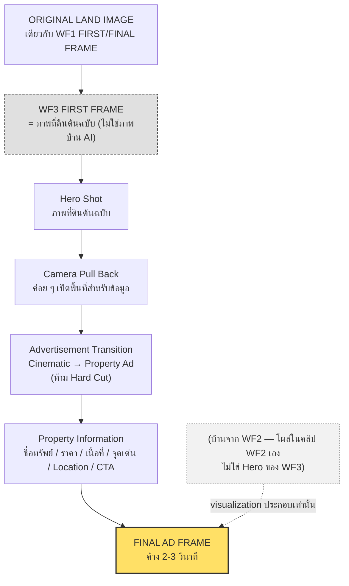

# WF3 — บ้านสวนยามค่ำ → Property Advertisement

> สเปคฉบับผู้ใช้ · ห้ามแก้ไขเนื้อหา · แก้ได้เฉพาะเจ้าของสเปค
> ก่อนหน้า: [WF2.md](WF2.md) · เริ่มต้น: [WF1.md](WF1.md)

## INPUT

> **แก้ไขโดยเจ้าของสเปค (2026-09-10):** ภาพหลักของโฆษณาต้องเป็น **ภาพที่ดินต้นฉบับจริง** ไม่ใช่ภาพบ้านที่ AI สร้างขึ้นใน WF2 — "จะขายรูปต้นฉบับ ไม่ได้ขายรูป AI" บ้านจาก WF2 เป็นแค่ภาพประกอบที่โผล่ระหว่างวิดีโอเท่านั้น

ใช้ **ภาพที่ดินต้นฉบับ (ภาพเดียวกับ FIRST/FINAL FRAME ของ WF1)** เป็นภาพเริ่มต้นและภาพหลักของวิดีโอโฆษณา

**FIRST FRAME = ORIGINAL LAND IMAGE (เดียวกับ WF1)**

ภาพบ้านสวนจาก WF2 (FINAL FRAME WF2) ยังคงปรากฏอยู่ในวิดีโอที่ต่อกันมา (เป็นส่วนของคลิป WF2 เอง) แต่ **ไม่ใช่ Hero Image ของ WF3** — Hero ของ WF3 ต้องเป็นภาพที่ดินจริงเท่านั้น เพราะสิ่งที่ขายคือที่ดินแปลงนี้ บ้านเป็นแค่ภาพจำลองว่า "พัฒนาแล้วจะน่าอยู่แค่ไหน"

ห้ามสร้างบ้านใหม่ · ห้ามเปลี่ยนภูมิประเทศ · ห้ามเปลี่ยนบรรยากาศของพื้นที่ · ห้ามให้ภาพบ้าน AI มาแทนที่ภาพที่ดินจริงในเฟรมหลัก

## FLOW (Diagram)

> เพิ่มเป็นภาพประกอบเสริม — สะท้อนการแก้ไขด้านบน (เจ้าของสเปคอนุมัติแล้ว)



## SCENE 1 — RETURN TO THE ORIGINAL LAND

เริ่มวิดีโอด้วย**ภาพที่ดินต้นฉบับจริง** (ภาพเดียวกับที่ WF1 จบด้วย) ให้กล้องเคลื่อนที่อย่างช้า ๆ และเป็นธรรมชาติ

ใช้: Slow Push In · Subtle Dolly · Gentle Camera Drift

แสดงให้เห็น: สภาพที่ดินจริง · ถนน · แนวต้นไม้ · ภูมิประเทศจริงของแปลง

บรรยากาศตามภาพต้นฉบับจริง — **ไม่ใช่ภาพบ้าน AI**

## SCENE 2 — HERO PROPERTY SHOT

ค่อย ๆ จัด Composition ให้**ที่ดินแปลงนี้**อยู่ในตำแหน่งที่เหมาะสมสำหรับ Advertisement

**ที่ดินจริงเป็น Hero Object** ของ WF3 — ไม่ใช่บ้านที่ AI สร้างใน WF2

ภาพต้องให้ความรู้สึก: **นี่คือแปลงจริง ที่ดินจริง น่าลงทุน/น่าอยู่**

**อย่าเปลี่ยนภาพเป็น Graphic เร็วเกินไป** ให้ผู้ชมได้เห็นที่ดินเต็ม ๆ ก่อน

## SCENE 3 — TRANSITION TO ADVERTISEMENT

เริ่ม Transition จากภาพที่ดินจริงไปสู่ Advertisement Layout

ใช้การ: Slow Pull Back · Slight Zoom Out · Cinematic Reframe · Subtle Light Transition

เมื่อกล้อง Pull Back: ภาพที่ดินจริงค่อย ๆ ถูกจัดองค์ประกอบให้อยู่ใน Advertisement Frame
จากนั้นข้อมูล Property Information ค่อย ๆ ปรากฏขึ้น

## TRANSITION STYLE

**ห้าม Hard Cut · ห้ามเปลี่ยนเป็น Graphic แบบกระทันหัน**

```text
Cinematic Land Shot
→ Camera Pull Back
→ Advertisement Composition
→ Property Information Appears
```

ภาพที่ดินจริงยังต้องเป็นส่วนหนึ่งของ Layout

## ADVERTISEMENT DESIGN

สไตล์: **Premium Cozy Real Estate Advertisement**

Mood: Warm · Elegant · Natural · Modern · Minimal · Homely · Trustworthy

ไม่ให้ดูเหมือนโฆษณาคอนโด · ไม่ให้ดูหรูเวอร์ · ไม่ใช้กราฟิกเยอะ · ไม่ใช้สีฉูดฉาด

## HERO IMAGE

> **แก้ไขโดยเจ้าของสเปค (2026-09-10):** ภาพหลัก = ภาพที่ดินต้นฉบับจริง ไม่ใช่ภาพบ้านที่ AI สร้างใน WF2

ให้**ภาพที่ดินต้นฉบับจริง**เป็นภาพหลัก ภาพควรใช้พื้นที่มากที่สุดเท่าที่เหมาะสม

ต้องยังมองเห็น: **สภาพที่ดินจริง + ภูมิประเทศ + ถนน + แนวต้นไม้**

บ้านสวนจาก WF2 เป็นเพียง**ภาพจำลองแนวคิด (Concept Visualization)** ที่ปรากฏในช่วง WF2 ของวิดีโอเท่านั้น ไม่ใช่ภาพหลักของ WF3 และไม่ใช่สิ่งที่นำมาขาย

## PROPERTY TITLE

แสดง Headline สั้น ๆ เช่น **"บ้านสวนกลางธรรมชาติ"** หรือ **"บ้านพักท่ามกลางธรรมชาติ"**

ให้ใช้ข้อความที่สอดคล้องกับข้อมูลจริง — ไม่สร้าง Claim ที่ไม่มีข้อมูลรองรับ

## PRICE

แสดงราคาขายให้เด่นที่สุดรองจากภาพ

รูปแบบ: **ราคา X,XXX,XXX บาท**

ใช้ตัวเลขจากข้อมูล Property Input เท่านั้น
**ห้ามเปลี่ยนตัวเลข · ห้ามประมาณราคา · ห้ามสร้างราคาใหม่**

## LAND SIZE

แสดงขนาดที่ดินอย่างชัดเจน เช่น **เนื้อที่ 1 ไร่ 2 งาน** หรือข้อมูลจริงของแปลง

ต้องใช้หน่วยตามข้อมูลที่ได้รับ

## KEY FEATURES

เลือกเฉพาะจุดเด่นสำคัญ **3–5 ข้อ** เช่น:

* บ้านสวนชั้นเดียว
* สวนธรรมชาติ
* โรงจอดรถ
* บรรยากาศเงียบสงบ
* ใกล้สถานที่ท่องเที่ยว

ใช้เฉพาะข้อมูลที่มีอยู่จริง — **ห้ามสร้างจุดขายขึ้นเอง**

## LOCATION

แสดงตำแหน่ง: **ตำบล / อำเภอ / จังหวัด**

ถ้ามีข้อมูลสถานที่ใกล้เคียง สามารถแสดงได้ เช่น ใกล้เขื่อน · ใกล้น้ำตก · ใกล้ถนนหลัก · ใกล้ร้านสะดวกซื้อ
แต่ต้องใช้ระยะทางตามข้อมูลจริง

## CTA

ส่วนล่างของ Advertisement ใช้ข้อความที่ชัดเจนและเป็นธรรมชาติ เช่น:

> **"สนใจรายละเอียด / นัดชมบ้าน ทักแชตได้เลย"**
> **"สอบถามรายละเอียดและนัดชมทรัพย์"**

หากมีช่องทางติดต่อ ให้แสดงตามข้อมูล Input

## INFORMATION HIERARCHY

```text
1. บ้านและภาพทรัพย์สิน   ต้องโดดเด่นที่สุด
2. ราคา                  ต้องอ่านได้ทันที
3. ขนาดที่ดิน            ต้องเห็นชัด
4. จุดเด่น               สั้น กระชับ 3–5 ข้อ
5. Location              ตำแหน่งทรัพย์
6. CTA                   สิ่งที่ลูกค้าต้องทำต่อ
```

## GRAPHIC STYLE

ใช้ Layout ที่เหมาะกับการดูบนมือถือ — **9:16 Vertical Advertisement**

Typography: อ่านง่าย · ตัวเลขราคาขนาดใหญ่ · Headline ชัด · ไม่ใช้ Font หลายแบบ · **ไม่ใส่ข้อความทับบริเวณที่ดินจนบดบังภาพ**

ใช้พื้นที่ว่างอย่างเหมาะสม ภาพต้องดูสะอาดและ Premium

## COLOR & LIGHT

ใช้ Mood ที่ต่อเนื่องกับบ้าน: **Warm Evening**

โทนโดยรวม: Deep Natural Background · Warm White Light · Earth Tone · Soft Neutral · Subtle Gold/Warm Accent

**หลีกเลี่ยง:** สีแดงสด · สีเขียวสดจัด · สีฟ้านีออน · Gradient ฉูดฉาด · Graphic Effect เยอะ

## FINAL ADVERTISEMENT FRAME

จบด้วย Advertisement Layout แบบนิ่ง ให้ค้างประมาณ **2–3 วินาที**

ผู้ชมต้องมีเวลาอ่าน: ชื่อทรัพย์ · ราคา · เนื้อที่ · จุดเด่น · Location · CTA

**ภาพที่ดินต้นฉบับจริงยังต้องเป็น Hero Image** (ไม่ใช่ภาพบ้าน AI)

## FINAL FRAME COMPOSITION

```text
[ภาพที่ดินต้นฉบับจริง]

บ้านสวนกลางธรรมชาติ

ราคา 1,XXX,XXX บาท

เนื้อที่ X ไร่ X งาน X ตร.ว.

• บ้านสวนชั้นเดียว
• สวนธรรมชาติ
• โรงจอดรถ
• บรรยากาศสงบ

[ตำบล] [อำเภอ] [จังหวัด]

สนใจทักแชตเพื่อรับรายละเอียด
```

ตัวเลขและข้อมูลทั้งหมดต้องแทนด้วยข้อมูลจริงจาก Property Input

## CONTINUITY RULE

> **แก้ไขโดยเจ้าของสเปค (2026-09-10):** WF3 ไม่ได้ต่อจากเฟรมสุดท้ายของ WF2 อีกต่อไป — ต่อจาก**ภาพที่ดินต้นฉบับ**โดยตรง (เฟรมเดียวกับ WF1) เพราะสิ่งที่ขายคือที่ดิน ไม่ใช่ภาพบ้านที่ AI สร้าง

> **WF3 FIRST FRAME = ORIGINAL LAND IMAGE (เดียวกับ WF1 FIRST/FINAL FRAME)**

ห้ามให้ภาพบ้าน AI จาก WF2 มาแทนที่ภาพที่ดินจริงในเฟรมหลักของ WF3 · ห้ามเปลี่ยนพื้นหลัง · ห้ามเปลี่ยนภูมิประเทศ

## MASTER CREATIVE DIRECTION

ทั้ง 3 Workflow ต้องรู้สึกเหมือนเป็นโฆษณาชิ้นเดียว:

```text
WF1  ที่ดินจริง → ถอยกล้อง/ลอยขึ้น → Wide Landscape → Satellite View → Pin
     → พุ่งกลับลงมา → ผ่านเมฆ → กลับสู่ที่ดินจริงเดิม (loop)

WF2  ที่ดินจริง (เฟรมเดียวกับที่ WF1 จบ) → ก่อสร้าง → บ้านสวน 1 ชั้น → สวน + โรงรถ
     → บ้านเสร็จ → Warm Cozy Evening (ภาพจำลองแนวคิด)

WF3  กลับสู่ที่ดินต้นฉบับจริง → Hero Shot (ที่ดิน) → Pull Back → Property Advertisement
     → ราคา + เนื้อที่ + จุดเด่น + Location + CTA
```

## ABSOLUTE RULE

> **DO NOT CHANGE THE PROPERTY. SELL THE REAL PHOTO, NOT THE AI PHOTO.**

The final advertisement must still represent the exact property shown in the previous workflows —
and its HERO IMAGE must be the original real land photo, not WF2's AI-generated house.

The house shown during WF2 is a visualization of what could be developed on the land, nothing more.
The original land environment remains the visual identity of the property, and is what WF3 sells.

The advertisement should make the viewer feel:

> **"นี่คือที่ดินแปลงนี้ และนี่คือภาพว่าถ้าพัฒนาขึ้นมาแล้วจะน่าอยู่แค่ไหน"**

## FINAL OUTPUT

* Video Ad แนวตั้ง 9:16
* Final Advertisement Frame
* Static Advertisement Image
* Caption สำหรับโพสต์
* รายการข้อมูลที่ใช้ใน Advertisement
* รายการข้อมูลที่ไม่ได้ใช้เพราะไม่มีการยืนยัน
